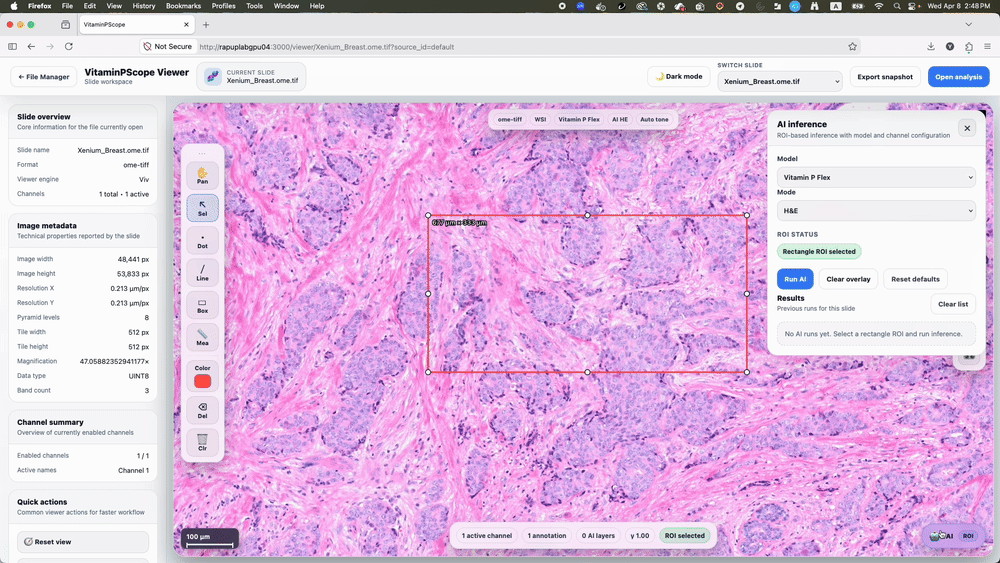

# VitaminPScope — AI Digital Pathology Viewer for Whole-Slide Images (WSI).


**VitaminPScope** is an AI-powered digital pathology platform for viewing whole-slide images (WSI) and performing whole-cell segmentation using deep learning.

It supports SVS, OME-TIFF, and multi-channel microscopy, and runs locally with Docker in a single command.

<div align="center">

🚀 **Run in one command — no setup, no configuration**

[🐳 Docker](#-quick-start) • [🐛 Issues](https://github.com/idso-fa1-pathology/VitaminPScope/issues)

</div>

---

<p align="center">
  
</p>

---

## ✨ Overview

VitaminPScope is a production-ready, web-based platform for:

- Whole-slide image (WSI) viewing  
- Multi-channel microscopy visualization  
- Slide comparison and annotation  
- AI-powered whole-cell segmentation with **VitaminP**

Built with **React + FastAPI + OpenSeadragon + Viv** — optimized for real-world deployment.

**VitaminPScope is an open-source alternative to commercial digital pathology platforms (e.g., QuPath, HALO) with built-in AI segmentation**

---

## 💡 Why VitaminPScope

- 🧠 Built-in AI — no external pipelines required  
- ⚡ Runs locally with Docker in minutes  
- 🔬 Designed for real pathology workflows  
- 📊 Scales to gigapixel whole-slide images  

---

## 🎬 Demo

<p align="center">
  
</p>

---

## 🔍 Keywords

digital pathology, WSI viewer, whole-slide image viewer, pathology AI, cell segmentation, histopathology, H&E analysis, multiplex imaging, computational pathology, FastAPI, React viewer

---

# 🚀 Quick Start

### 1. Clone repository

```bash
git clone https://github.com/idso-fa1-pathology/VitaminPScope.git
```

### 2. Move into project

```bash
cd VitaminPScope
```

### 3. Launch the app

## ⚙️ GPU Support (Optional)

VitaminPScope runs out-of-the-box on both CPU and GPU environments.

### 🖥️ Run on CPU (default)

```bash
docker compose -f docker-compose.public.yml up -d
```

---

### 🚀 Run with GPU (Linux + NVIDIA only)

```bash
docker compose -f docker-compose.public.yml --profile gpu up -d
```

---

## ⚡ One-line setup

### 🖥️ CPU (default)
```bash
git clone https://github.com/idso-fa1-pathology/VitaminPScope.git && cd VitaminPScope && docker compose -f docker-compose.public.yml up -d
```
### 🚀 GPU (Linux + NVIDIA)
```bash
git clone https://github.com/idso-fa1-pathology/VitaminPScope.git && cd VitaminPScope && docker compose -f docker-compose.public.yml --profile gpu up -d
```


---

## 🌐 Open the app

Once running, open in your browser:

👉 **http://localhost:3000**

---

## 📂 Data

Place your slides in:

```
./data/
```

**Supported formats:**
- SVS  
- NDPI  
- TIFF / OME-TIFF  

---

## 🤖 Powered by VitaminP

This platform integrates **VitaminP**, a state-of-the-art AI model for whole-cell segmentation.

➡️ https://github.com/idso-fa1-pathology/vitaminp

---

## 🧪 Use Cases

- Histopathology research (H&E analysis)  
- Spatial transcriptomics validation  
- Multiplex imaging visualization  
- AI-assisted cell segmentation workflows  
- Digital pathology education and demos  

---

## 🏗 Architecture

- **Frontend:** React + OpenSeadragon (WSI rendering)  
- **Backend:** FastAPI (API + orchestration)  
- **AI Service:** VitaminP inference engine  
- **Deployment:** Docker Compose (multi-service)  

---

## 🔌 Extensibility

VitaminPScope can be extended via API or integrated into custom pipelines for automated pathology workflows.

---

## 🧠 AI Model

The **VitaminP model is already included** inside the Docker image.

✅ No downloads  
✅ No configuration  
✅ Ready out of the box  

---

## 📄 License

MIT License
