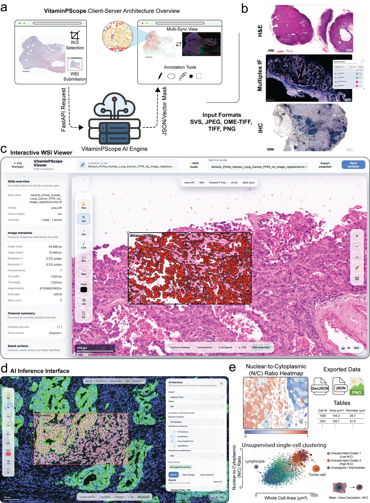

# VitaminPScope

VitaminPScope is a lightweight web-based digital pathology platform for browsing, organizing, and viewing whole-slide images and multichannel microscopy data.

It combines a modern Slide Manager workspace, high-performance viewers, and synchronized multi-slide comparison tools for research and diagnostic workflows.

The application is built with React, FastAPI, OpenSeadragon, and Viv, and runs easily using Docker Compose

---

[📄 Paper](#citation) • [🐛 Issues](https://github.com/idso-fa1-pathology/vitamin-p/issues) • [🐳 Docker](#-docker) • [📦 PyPI](https://pypi.org/project/vitaminp/)

</div>


---
<p align="center">
  
</p>


---

# Features

## Slide Manager Workspace

* Browse slides and folders
* Upload new slides
* Create folders
* Mount external data sources
* Search and filter slides
* Navigate using folder breadcrumbs
* View saved compare sessions
* View dataset statistics

The Slide Manager UI was redesigned to be cleaner, modern, and easier to use while keeping the existing architecture and functionality intact.

---

## Whole-Slide Viewing

* SVS / NDPI using OpenSeadragon
* OME-TIFF using Viv
* Fast zoom and pan
* Scale bar
* Measurement tools

---

## Multichannel Microscopy

* Toggle channels
* Adjust channel color
* Control opacity
* Real-time compositing

---

## Multi-Slide Compare View

* Synchronized zoom and pan
* Cross-slide inspection
* Save compare sessions

---

## Annotation Tools

* Points
* Lines
* Rectangles
* Measurements
* Select / edit annotations

---

# Project Structure

VitaminPScope
├── frontend
├── backend
├── ai_service
├── data
└── docker-compose.yml

---

# Supported Slide Formats

* SVS
* NDPI
* TIFF / OME-TIFF

---

# Running the Application

Requirements:

* Docker
* Docker Compose

Start:

```
docker compose up --build
```

Open:

```
http://localhost:5173
```

---

# Tech Stack

Frontend

* React
* Vite
* OpenSeadragon
* Viv

Backend

* FastAPI
* Python

Deployment

* Docker
* Docker Compose

---

# License

MIT License

